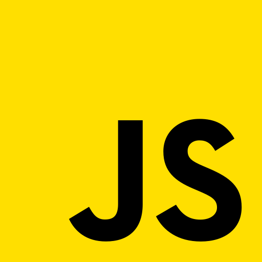
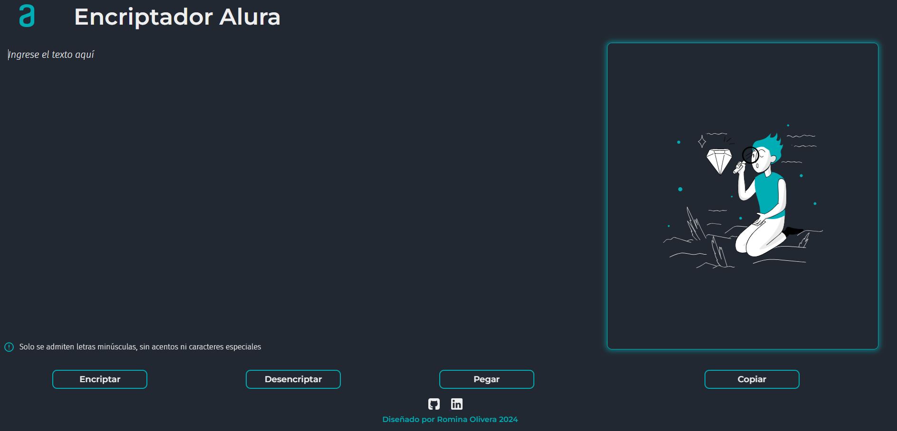
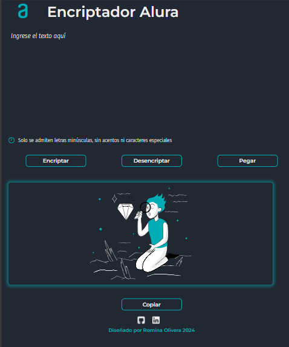
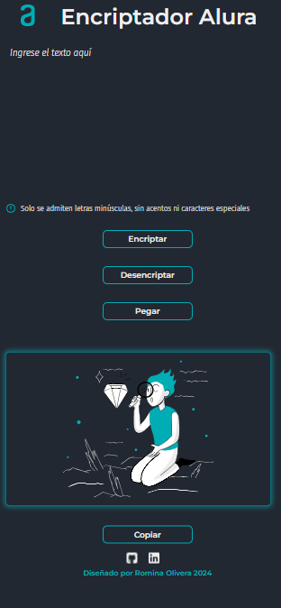

# PROYECTO ENCRIPTADOR DE TEXTO - Challenge ALURA LATAM G7

Hola a toda la comunidad, dejo por aquí mi primer desafío del Programa ONE de Oracle Next Education y Alura Latam, el mismo consistía en realizar desde cero un encriptador de texto, para poder encriptar o desencriptar textos siguiendo algunas pautas la que detallo acontinuación:

## Detalle del proyecto
Las "llaves" de encriptación que se utilizó para la parte lógica:

La letra "e" es convertida para "enter"
La letra "i" es convertida para "imes"
La letra "a" es convertida para "ai"
La letra "o" es convertida para "ober"
La letra "u" es convertida para "ufat"

### Requisitos
- Debe funcionar solo con letras minúsculas
- No deben ser utilizados letras con acentos ni caracteres especiales
- Debe ser posible convertir una palabra para la versión encriptada también devolver una palabra encriptada para su versión original.
    Por ejemplo:
    "gato" => "gaitober"
    gaitober" => "gato"

- La página debe tener campos para
    -Inserción del texto que será encriptado o desencriptado, y el usuario debe poder escoger entre as dos opciones.
    -El resultado debe ser mostrado en la pantalla.
  
### Objetivo

El objetivo de este proyecto era aplicar todos los conocimientos adquiridos durante el curso:

- **Uso de clases CSS**: Se aplicaron clases CSS para estilizar los elementos de la página.
- **Estilos situacionales**: Se utilizaron clases para aplicar estilos en situaciones específicas, como cuando un elemento es seleccionado o cuando el cursor pasa sobre él.
- **Reset CSS**: Se implementó un reset CSS para asegurar la consistencia en la visualización de los elementos en diferentes navegadores.
- **Modelo de caja**: Se comprendió y aplicó el modelo de caja para ajustar márgenes, bordes, y rellenos de los elementos.
- **Flexbox**: Se implemento Flexbox y sus diferentes propiedades, para el posicionamiento de los elementos.

### Extras

- **Un botón que copie el texto encriptado/desencriptado** para la sección de transferencia, o sea que tenga la misma funcionalidad del ctrl+C o de la opción "copiar" del menú de las aplicaciones.
- **Responsive Design**: La página es totalmente responsiva, adaptándose a diferentes dispositivos y tamaños de pantalla.
- Adicional a las funcionalidades solicitadas generé un botón que nos permite pegar el contenido copiado.

## Tecnologías utilizadas

- **HTML**: Para la estructura semántica del contenido.
- **CSS**: Para el diseño visual y la disposición de los elementos.
- **JavaScript**: Para el desarrollo de la lógica del encriptador.
- **GitHub**: Para el control de versiones y la colaboración.

            

## Imágenes

## GitHub Page

Puedes ver la demostración de este proyecto en GitHub Pages:

[Demo del proyecto en GitHub Pages](https://romina-olivera.github.io/Encriptador-Alura/)
